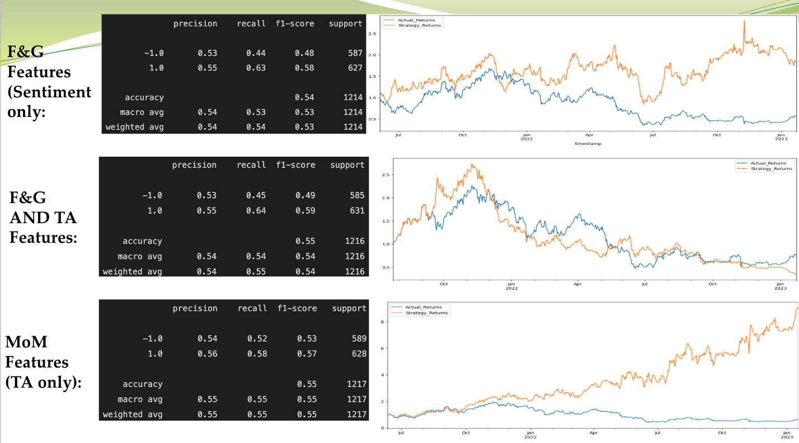
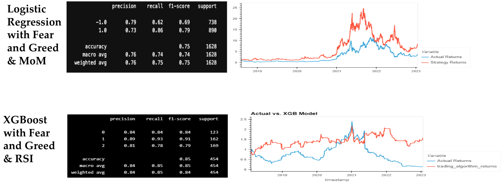

# Dreambuilder Bot
### *Where we build Dreams and MVPs*
### By: Adam, Faith, and Yen
--------------------------------------------

**Purpose of Project:** To identify when to buy, hold, and sell crypto using technical and sentiment analysis without being impacted by our emotions.

**Questions:**
- Which analysis is better to predict price movement for cryptos: technical or sentiment? 
- Can we combine sentiment and technical analysis with machine learning to build a profitable bot?
- Which machine learning model will optimize the results?

**Data Collection:**
- Yahoo Finance: Historical crypto price data (Daily timeframe)
- Requests library: to access API for Fear and Greed value
- FinTA library: easy to implement technical indicators
- Pytrends: daily reading of google searches for different cryptocurrencies
- Tweepy: Library to access twitter API for sentiment analysis.
- Japanese Candlestick library: for advanced technical indicators (Hammer & Doji)
- Alternative.me:  API used to pull Fear and Greed value
- Websocket-client: for pulling live crypto prices (every 10 seconds). Worked with the Binance API and Alpaca API

**Data Set:**
- Fear and Greed: Algorithm uses the daily Fear and Greed reading to determine whether to go long or short on a cryptocurrency. 
- Market momentum: the aggregate rate of acceleration for the broader market as a whole. It indicates if the trend is sustainable in the future. If MoM is greater than 0 then it is bullish and MoM is less than 0 it is bearish. 
- Chaikin Oscillator: measure the accumulation-distribution line of moving average convergence-divergence (MACD). It indicates if institutions/whales are buying or selling. 
- Kaufman Efficiency Ratio (ER): provide a method of quantifying a market’s noise. It assists with identifying false break out. 
- Vortex: spot trend reversals and confirm current trend by using a pair of oscillating lines. One to identify positive trend movement and the other to identify negative price movement. When the two crosses between the lines trigger buy and sell signals that are designed to capture the most dynamic trending action, higher or lower. 
- Relative Strength Index (RSI): measure the speed and magnitude of the recent price changes to evaluate overvalued or undervalued conditions in the price. Overvalued>70% and Undervalued < 30%

**Feature engineering techniques:** 
- Decision Tree: for dimensionality reduction
- Pandas.get_dummies: to convert categorical variable into dummy/indicator variable (1.0 long or -1.0 short)
- StandardScaler: to scale features for machine learning

**Machine Learning Models:**
- SVM: is a supervised learning model that we can use for classification and regression analysis. SVM separates classes of data points into multidimensional space. 

- MLPClassifier:  is a technique of feed-forward artificial neural networks using a back propagation learning method to classify the target variable used for supervised learning.

- Logistic regression: is a supervised machine learning model. It finds the best fit logistic function to describe the relationship between input variables (X) and a categorical output variable (y).

- XGBoost: is an ensemble learning algorithm that make predictions using Decision Trees.

**Results of Trained Models (SVM):**

---

**Results of Trained Models (Logistic regression and XGB):**

**Conclusion:**
At every fork in the road, we kept moving forward with MVP, but left lots of successful strategies to be explored. Both technical and sentiment analysis can be used with machine learning to build trading bots with high ROIs. From our results, we recommend creating a maintenance plan for the bot in order to monitor and tweak the model on a regular basis. 

**Requirements to Run Codes:**
- Python 3.8 version
- Alpaca Keys and env file
- Twitter account

